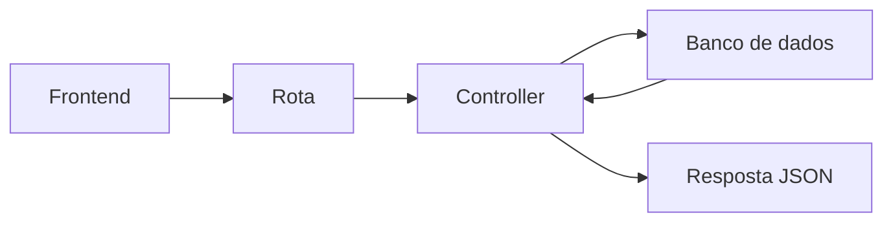

# API

API significa Application Programming Interface.

Uma API e uma forma de um sistema conversar com outro por meio de regras claras.

Neste projeto, o frontend faz requisicoes HTTP para a API e a API responde com JSON.

Fluxo simples:

A API define:
- quais rotas existem
- quais dados cada rota recebe
- que resposta cada rota devolve
- quais erros podem acontecer

Exemplo de uso:
- cadastrar usuario
- fazer login
- listar tarefas
- atualizar uma tarefa
- remover um registro

Uma boa API deixa o sistema organizado e facil de consumir por frontends, apps mobile e testes no Postman.